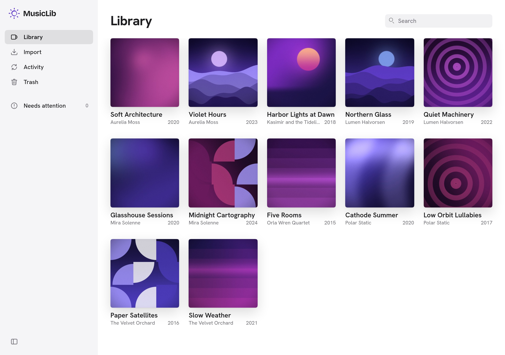
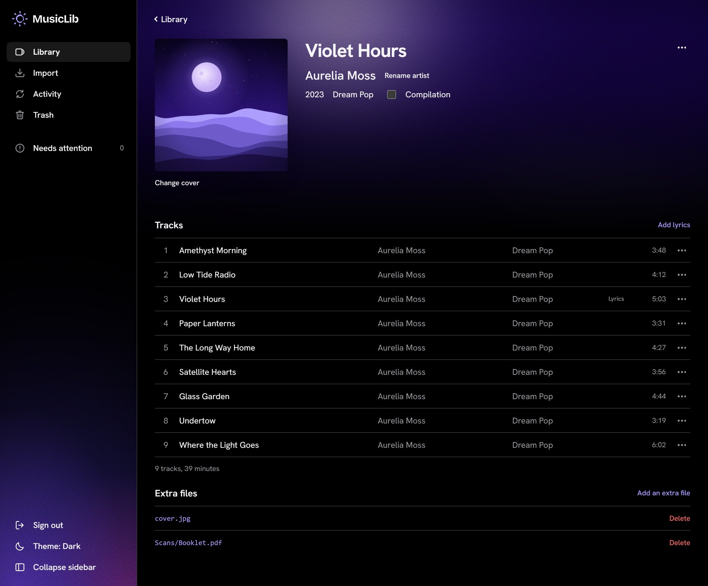

# Vibrance MusicLib

MusicLib keeps your music collection tidy without ever touching your original files.

1. **Import** your album folders. MusicLib copies each file into its own store and never changes, moves or deletes the source.
2. **Fix the metadata in your browser**: artists, album titles, years, genres, track titles and numbers, covers, lyrics and extra files such as booklets.
3. **MusicLib writes a clean library folder**: one folder per artist and per album, consistently named files, complete tags and the cover in every track. Any program that reads music folders can use it.

Each edit regenerates only the album it affects, and your original copies are kept forever. MusicLib is a self-hosted web app for one person. It runs in Docker on a Linux machine.





<sub>The artists, albums and covers in these screenshots are invented.</sub>

## Contents

- [What it does and doesn't do](#what-it-does-and-doesnt-do)
- [Requirements](#requirements)
- [Install](#install)
- [The guide](#the-guide)
- [Building from source](#building-from-source)
- [License](#license)

## What it does and doesn't do

**It does:**

- import album folders, including multi-disc albums, and report what it imported and what it skipped, and why;
- read and write tags of **FLAC**, **MP3** and **M4A** (AAC or ALAC) files;
- manage **JPEG and PNG covers**, **LRC lyrics** and **extra files** (booklets, scans, logs);
- let you search the library, move albums to the trash and restore them;
- verify its work: every copy is checked against the original, and the audio of each track is checked before and after its tags are written;
- check, back up and restore the whole collection.

**It doesn't:** play or stream music, convert audio between formats, look up metadata or recognize music online, watch folders for new files (you start each import), manage user accounts (there is one user, with one password), or edit arbitrary tags. The interface is in English.

## Requirements

- **Ubuntu 24.04 or later** on an **amd64** (x86-64) machine;
- **Docker Engine** with the **Compose v2** plugin (`docker compose`), and a user that can run `docker` without `sudo`;
- **local ext4 storage** for MusicLib's data;
- `curl` and `openssl`.

**Not supported:** Docker Desktop, NAS and network filesystems (NFS, SMB), filesystems other than ext4, and ARM machines. MusicLib checks its storage at every start and refuses what it can't use safely. How to check your machine: [What you need](docs/operations.md#what-you-need).

## Install

Paste this block into a terminal. It creates `~/musiclib`, downloads the two files of the latest release, writes a random database password and a random sign-in password into `.env`, and starts MusicLib:

```sh
mkdir -p ~/musiclib/import && cd ~/musiclib
[ -e compose.yaml ] || curl -fsSLO https://github.com/tommasonovelli/vibrance-musiclib/releases/latest/download/compose.yaml
[ -e .env ] || { curl -fsSL -o .env https://github.com/tommasonovelli/vibrance-musiclib/releases/latest/download/env.example && chmod 600 .env && sed -i "s/^POSTGRES_PASSWORD=.*/POSTGRES_PASSWORD=$(openssl rand -hex 32)/" .env && sed -i "s|^MUSICLIB_PASSWORD=.*|MUSICLIB_PASSWORD=$(openssl rand -base64 24)|" .env; }
docker compose up -d --wait
```

When the last command returns, open **<http://127.0.0.1:8080>** in a browser on the same machine and sign in with the password the block wrote into `.env`. To read it, run `grep MUSICLIB_PASSWORD .env` in `~/musiclib`. Then put your albums in **`~/musiclib/import`** and import them from the **Import** page.

Good to know:

- **To keep the data in a folder of your choice** instead of Docker's storage, read [The data in a host folder](docs/operations.md#the-data-in-a-host-folder) **before** you run the last line.
- The block is safe to paste twice: it never replaces an existing `compose.yaml` or `.env`. What each line does, and what it creates: [First start](docs/operations.md#first-start).
- `.env` holds both passwords: keep it private (the block makes it readable by you only).
- **Upgrading from 1.0.0?** 1.1.0 does not start without a sign-in password: see [From 1.0.0 to 1.1.0](docs/operations.md#from-100-to-110).

> **Never run `docker compose down -v`: it deletes your library, its database and its backup volume.** To stop MusicLib, use `docker compose stop`.

## The guide

Everything else is in the [operations guide](docs/operations.md), in the order you need it:

- [Configuration](docs/operations.md#configuration): every setting of `.env`, with its default and an example.
- [Where your files are](docs/operations.md#where-your-files-are): the library folder, disk space, and [the data in a host folder](docs/operations.md#the-data-in-a-host-folder).
- [The passwords](docs/operations.md#the-passwords): reading and changing the sign-in and database passwords.
- [Access from other devices](docs/operations.md#access-from-other-devices): an SSH tunnel, your home network, or [HTTPS and a domain name](docs/operations.md#https-and-a-domain-name) with Caddy.
- [Importing and the Activity page](docs/operations.md#importing-and-the-activity-page): how folders become albums, and what to do when an import needs attention.
- [Backups, restore and moving](docs/operations.md#backups-restore-and-moving).
- [Upgrading](docs/operations.md#upgrading).
- [Maintenance](docs/operations.md#maintenance): checking the library with `doctor`, regenerating it with `rebuild`.
- [Troubleshooting](docs/operations.md#troubleshooting): what each error code means and what to do.
- [The API](docs/operations.md#the-api): everything the interface does, with `curl` examples.

## Building from source

The app image holds a Go server with its web interface built in, FFmpeg and a small TagLib-based tag writer, all pinned to exact versions; PostgreSQL 17 runs in its own container, from its own pinned image. To build the app from a clone of the repository instead of using the published image, see [Running from source](docs/operations.md#running-from-source).

To contribute, read [CONTRIBUTING.md](CONTRIBUTING.md). Development, tests, pinned dependencies and releases are in the [developer guide](docs/docker.md).

## License

MusicLib's code and documentation are released under the [MIT License](LICENSE), copyright 2026 tommasonovelli.

The sun logo is the author's artwork and is **not** covered by the MIT License: you may keep it in unmodified copies, but a modified version you distribute must use its own symbol. See [LOGO.md](LOGO.md).

Third-party software and assets keep their own licenses, among them the Hanken Grotesk font, under the [SIL Open Font License](web/OFL.txt). [THIRD_PARTY_NOTICES.md](THIRD_PARTY_NOTICES.md) lists everything the Docker image contains, with versions, licenses and where to get the sources; it is also in the image, under `/usr/share/doc/musiclib/`. Each GitHub release attaches it together with the source tarballs of FFmpeg and TagLib.
